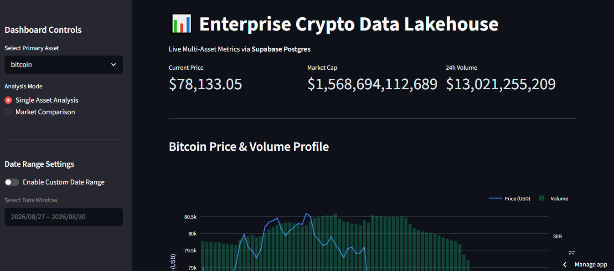
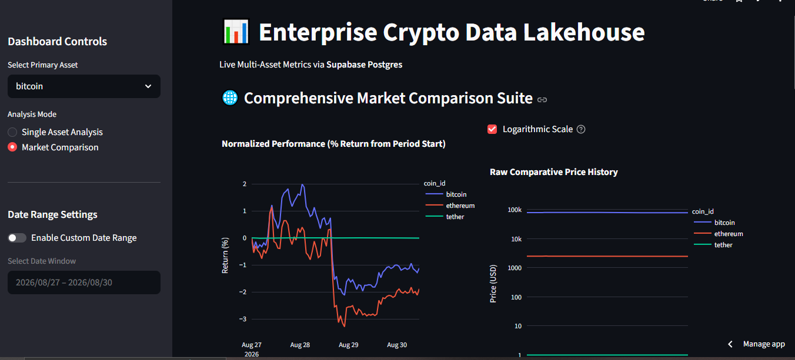

# 📊 Enterprise Crypto Data Lakehouse & Secure API

A 100% free-tier, serverless data pipeline and analytics platform designed to extract, store, process, and serve multi-asset cryptocurrency metrics[cite: 7]. This project demonstrates an end-to-end data engineering lifecycle, from automated ingestion to secure API distribution and interactive data visualization.

---

## 🏗️ System Architecture & Topography

This pipeline is built entirely on free-tier, serverless infrastructure, requiring no billing profiles[cite: 7]. 

| Subsystem | Technology Choice | Purpose & Constraints |
| :--- | :--- | :--- |
| **Ingestion Engine** | GitHub Actions | Automated CRON job execution (2,000 free minutes/mo) pulling from source APIs[cite: 7]. |
| **Processing Logic** | Python 3.10+ | Handles data extraction, normalization, and pushing data to the warehouse[cite: 7]. |
| **Data Warehouse** | Supabase (Postgres) | 500MB Free tier database for storing historical metrics permanently[cite: 7]. |
| **API Gateway** | Render + FastAPI | Serves as a robust middle-layer for data querying and access control[cite: 7]. |
| **Visualization** | Streamlit Cloud | Frontend dashboard connected to APIs/DB natively, hosted entirely free[cite: 7]. |

**Architecture Data Flow:**
1. **Trigger & Extract:** GitHub Actions runs on a schedule (e.g., 6:00 AM daily), requesting data from external APIs like CoinGecko[cite: 7].
2. **Load & Store:** Python scripts push sanitized records securely into the Supabase Postgres database[cite: 7]. *(The daily insertion query prevents Supabase from automatically pausing the database after 7 days of inactivity[cite: 7]).*
3. **Serve:** A FastAPI gateway on Render securely connects to Supabase and exposes standardized endpoints[cite: 7]. *(Note: Render spins down the free web service after 15 minutes of inactivity; the first request may experience a 30-50 second cold start latency[cite: 7]).*
4. **Consume:** The Streamlit dashboard queries the FastAPI endpoints and database to visualize parameters interactively[cite: 7].

---

## 📸 Dashboard Showcase

*(**Note to recruiter/reviewer:** The live dashboard is gated to protect database limits. Below are screenshots of the internal views.)*

### 1. Single Asset Analysis (Price & Volume Profile)


### 2. Comprehensive Market Comparison Suite


---

## 🚀 Key Engineering Features

*   **Automated Data Governance:** Implements a rolling 3-year data retention purge to ensure the database stays within the 500MB storage limit[cite: 7].
*   **Data Cleaning:** Python extraction scripts handle network timeouts, validate JSON responses, and filter out null or negative financial records.
*   **Secure API Authentication:** The FastAPI gateway restricts access via custom `X-API-Key` headers, backed by cryptographic token generation.
*   **Advanced Analytics:** The Streamlit dashboard engineers on-the-fly KPIs like *Trading Velocity (Volume/Market Cap %)* and *Market Cap Dominance Share*.

---

## 🔐 Security & Local Setup

**Security Note:** For security purposes, all production API keys, database credentials, and service role keys have been removed from this public repository. Database connections require injected environment variables established directly in the hosting environment's secure panel[cite: 7].

To run this pipeline locally, you must create a `.env` file in the root directory and supply your own credentials. 

**1. Create a `.env` file based on this template:**
```env
SUPABASE_URL=your_supabase_project_url
SUPABASE_SERVICE_ROLE_KEY=your_supabase_service_role_key
SUPABASE_ANON_KEY=your_supabase_anon_key
COINGECKO_API_KEY=your_coingecko_api_key_if_applicable
```

**2. Install Dependencies:**
```cmd
pip install -r requirements.txt
```

**3. Run the API Gateway Locally:**
```cmd
uvicorn main:app --host 0.0.0.0 --port 8000
```
